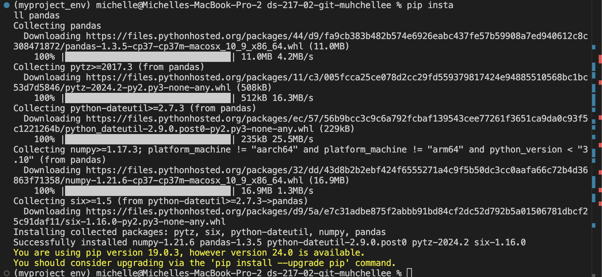

# Introduction

## Who am I? 

I'm currently a 1st year Health Data Science Masters student at UCSF but have been working here for the past 2 years as a Research Data Analyst. I graduated from UCSB in 2021 with a degree in Statistics and Data Science. 

## Why am I here?

I'm in this program to advance my technological and research skill set– not too sure if I want to move into industry or a PhD just yet, hopefully will figure that out after talking to more faculty/students and deciding what my interests are. 

## What am I hoping to get out of the course?

I took some Python courses in college but am a bit rusty since my work was primarily in R so I'm hoping to brush up on my Python skills and also maybe touch on some AI use cases (specifically generative AI) since my current lab's research interests surround generative AI. I also have little to no experience with Git or any sort of version control workflow so I hope to learn these skills in order to succeed in my academic and professional career!

## Python package installation screenshot

## Favorite meme (one of them)
[Sorry](https://www.tiktok.com/t/ZTFjao9Hp/)